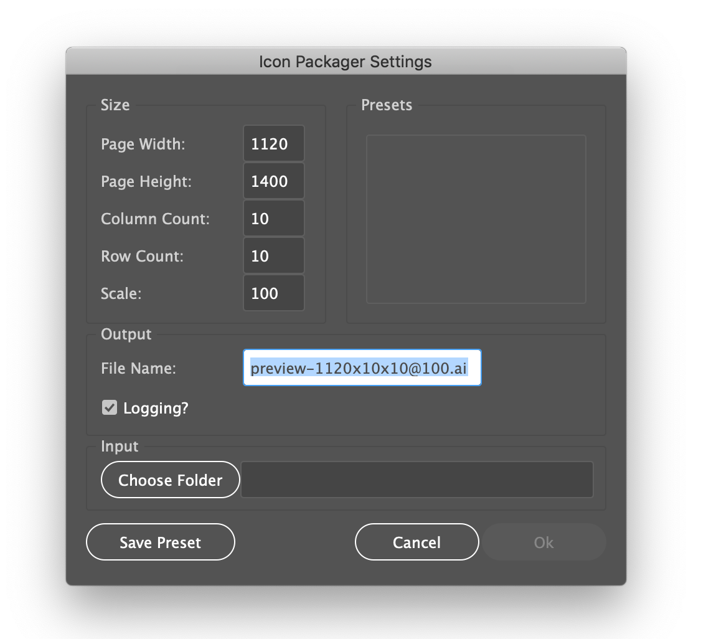
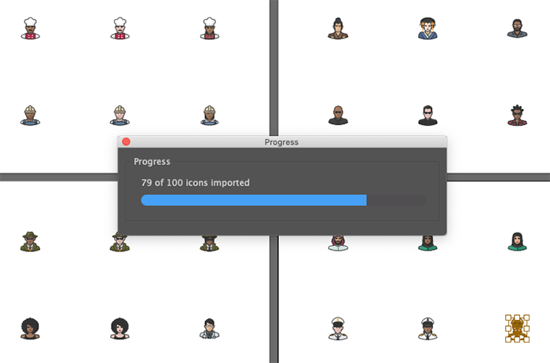
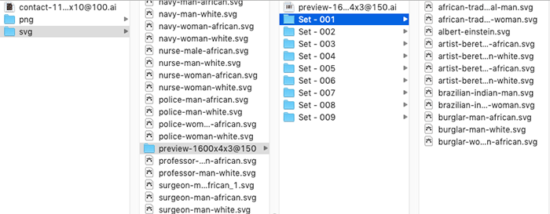

So you have a collection of 1,000 icons and you want to sell them on marketplaces that have a subscription-based business model. You spent hundreds, possibly thousands of hours crafting your icons only to have these marketplaces give them away for pennies to their subscribers. You can help lessen the negative impact by splitting your collection into smaller sets of 10 - 20 icons. This is where **Icon Packer** comes in. 
<!--more-->
Follow the instructions below to install **Icon Packager** then simply run the script and select a folder containing all of your icon SVG files. **Icon Packager** will copy your collection into sub-folders in the main folder as sets of however many icons you specify. Additionally, **Icon Packager** will create preview images of each set. You can then easily ZIP each set and upload to the marketplace of your choice.

***
#### Support Open Source Development

Donations help open source developers, who are often self-employed freelancers, continue to create free resources. You can donate to this project using the button below.

***

## Installation
To use this script, you will need to copy the entire **Icon Packager** folder to your Illustrator scripts folder, then restart Illustrator. Follow the steps below to install.

1. Unzip the **Icon Packager** ZIP archive.
1. Copy the **Icon Packager** folder to _Adobe Illlustrator/Presets/{language}/Scripts/_ where {language} is your chosen language. For example, if you have a US version of Illustrator this will be _en_US_.
1. Restart Illustrator
1. Once Illustrator restarts, verify that the script was installed by going to _File &gt; Scripts &gt; Icon Packager_

## Usage

1. After you follow the installation instructions above, go to _File &gt; Scripts &gt; Icon Packager_ to launch the script. You will see a dialog like the one below.   

1. **Icon Packager** divides your larger collection into smaller sets, creates a contact sheet for the icons in each set, arranged into a grid. The icons for each smaller set are copied into a sub-folder named in form _Set 01_, _Set 02_, etc.   Using the dialog inputs, specify the page width and height, the number of columns and rows, the scale of the imports (from 1 to 100 - do not include the percent sign). Once you have the values you want, you can click the _Save Preset_ button to save these settings for future use.
1. You might notice that **Icon Packager** does not allow you to explicitly specify the number of subsets. This is intentional. You can indirectly specify the number of smaller sets based on how many rows and columns you specify for the preview images. The reason for doing it this way is to allow you to focus on creating your preview images and let **Icon Packager** make sure the numbers add up. Simply specify how many icons you want on each preview image, and **Icon Packager** will create the appropriate sub-sets for you.
1. Click the _Choose Folder_ button to select your folder of SVG files (_NOTE: Icon Packager was created to create previews of icon sets so for now it only works with SVG files_).
1. Double-check your settings and click _Ok_. **Icon Packager** will display a progress dialog to let you know how many files are left to import. Once the files are imported and arranged, the file will be saved to the name you specified.
1. If you checked the _Logging?_ checkbox, you can view the log file in _/your-home-folder/ai-icon-packager_ where _~/_. For example, on a Mac the folder can be found at _/Users/yourname/ai-icon-packager/_ (or _~/ai-icon-packager/_ for shorthand). The preset configuration files can also be found in this location.   
1. The resulting output of <strong>Icon Packager</strong> is a subfolder containing a master file of the preview images (Contact Sheets) and another sub-folder named for each set with the icons from that set. 

### Custom Configuration
**NOTE** : changing the default configuration can break the **Icon Packager** utility. Proceed with caution.

You can change many of the default settings such as the location of the presets and log files, Illustrator version compatibility, etc., by editing the _config.js_ file in the download.

## Disclaimer of Liability

This script is offered AS-IS without any warranty or guarantees of any kind. You use this script completely at your own risk and under no circumstances will the developer and/or distributor of this script be held liable for damages of any kind including loss of data or damage to hardware or software. If you do not agree to these terms, do not use this script.

## Attribution

You are free to use, modify, and distribute this script as you see fit as long as you maintain the copyright notices in the original source files. A link to the Atomic Lotus website would be appreciated as well. You must also extend the same license to users of your code. This is not to say that your original code must be open source, but the code from this project must remain free and open forever.

Attribution:

Contact Sheet by: 
Scott Lewis &lt;scott@atomiclotus.net&gt; 
https://atomiclotus.net